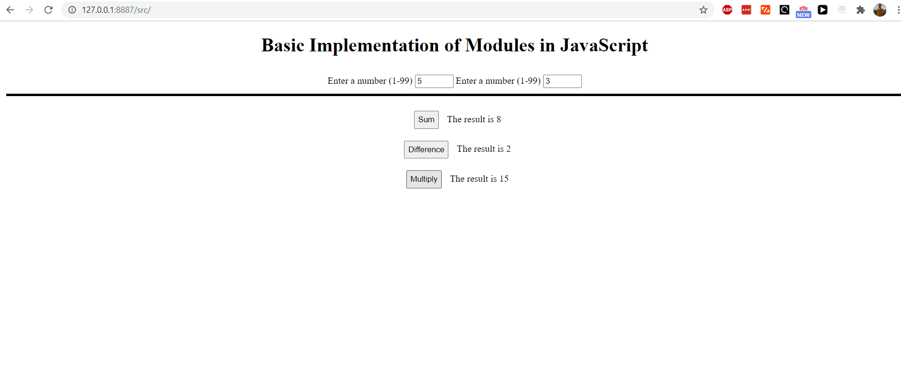

# Basic-implementation-of-modules

In this project I have created 3 basic functions that are exported from one JavaScript file and imported into another JavaScript file. These functions are then used to modify the DOM.
The purpose of the project was to see how to use modules.
You can see a screenshot of the application below.

